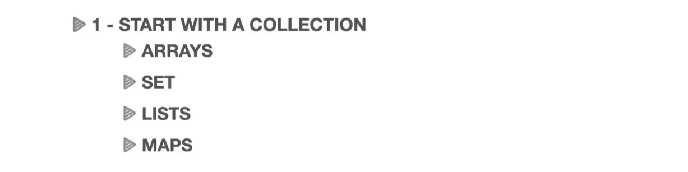
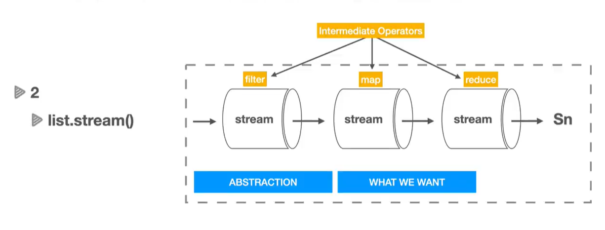
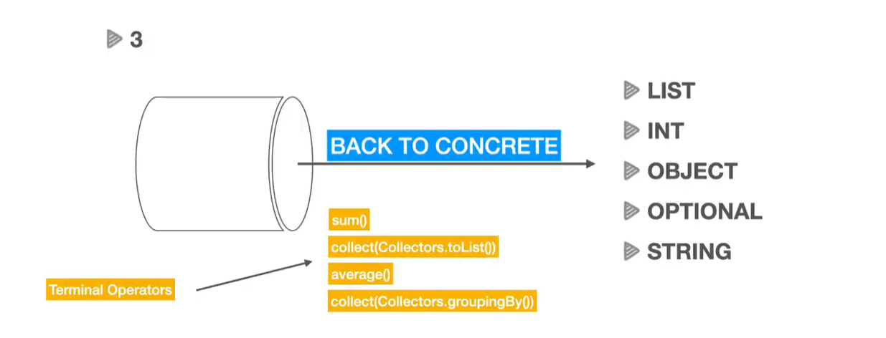

### How to use Java Streams:
1. Start with a collection (Arrays, Sets, Lists, Maps) 

   

2. Abstraction (what we want):  
we can have multiple streams  

Use of Intermediate Operators: filter, map and reduce

3 - back to concrete 

Use of Terminal Operators: collect, forEach, reduce

### Course content
1. Getting started
2. Working with Streams
3. IntStreams  
Methods of IntStreams class:  
   public static IntStream range(int startInclusive, int endExclusive) {}
4. Min and Max  
   Optional<T> min(Comparator<? super T> comparator);
5. Distinct & Sets